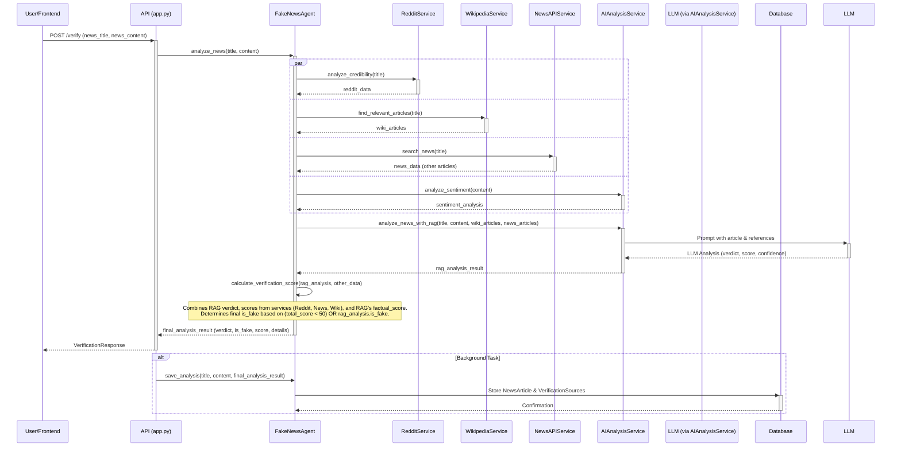

# Sequence Diagram: Fake News Detection Flow

This diagram illustrates the sequence of interactions when a news article is submitted for verification.

**Key Steps in the Diagram:**

1.  **User Request:** The User (or a frontend like Streamlit) sends a request to the backend API (`/verify`) with the news title and content.
2.  **API to Agent:** The API (`app.py`) receives the request and calls the `FakeNewsAgent` to handle the analysis.
3.  **Parallel Data Gathering:** The `FakeNewsAgent` initiates several calls in parallel to:
    *   `RedditService`: To analyze discussions and credibility on Reddit.
    *   `WikipediaService`: To find relevant Wikipedia articles for context.
    *   `NewsAPIService`: To search for other news articles on the same topic from various sources.
    *   `AIAnalysisService`: To perform an initial sentiment analysis on the content.
4.  **RAG Analysis:**
    *   Once the initial data is gathered, the `FakeNewsAgent` calls the `analyze_news_with_rag` method in the `AIAnalysisService`.
    *   The `AIAnalysisService` constructs a detailed prompt including the original article, and the contextual information from Wikipedia and other news articles.
    *   This prompt is sent to a Large Language Model (LLM).
    *   The LLM returns its analysis (including a verdict like "REAL" or "FAKE", a factual score, and confidence).
5.  **Score Calculation & Final Verdict:**
    *   The `FakeNewsAgent` receives the `rag_analysis_result`.
    *   It then calls its internal `calculate_verification_score` method. This method combines:
        *   The direct verdict and `is_fake` flag from the `rag_analysis_result`.
        *   Scores derived from Reddit data, Wikipedia context, and other news sources.
        *   The `factual_score` provided by the RAG analysis.
    *   The final `is_fake` status is determined by the formula: `(total_score < 50) OR rag_analysis_result["is_fake"]`.
6.  **Response to User:** The `FakeNewsAgent` returns the comprehensive analysis result to the API, which then formats it and sends it back to the User/Frontend.
7.  **Background Save (Optional):** The API can trigger a background task for the `FakeNewsAgent` to save the detailed analysis (including the article, verdict, and sources used) to the Database.

This diagram provides a high-level overview of the main interactions. Each service might have further internal logic or calls not detailed here for simplicity.
